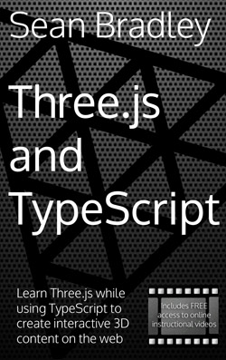
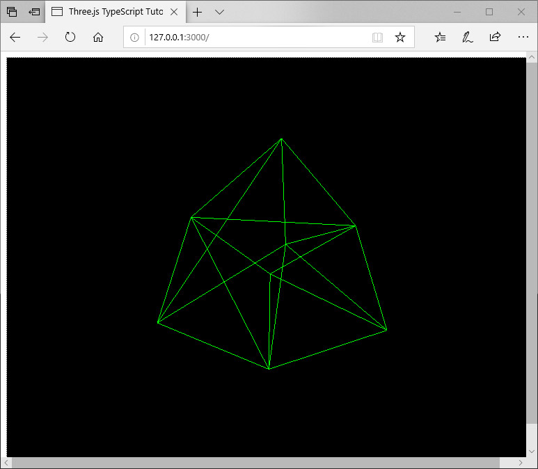
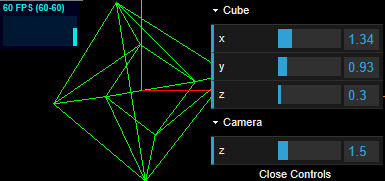
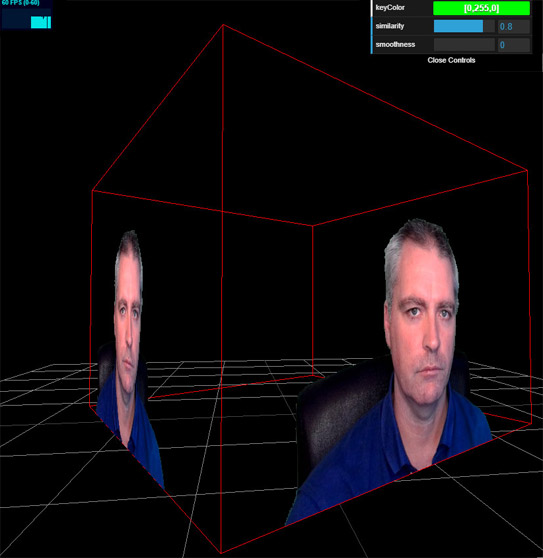
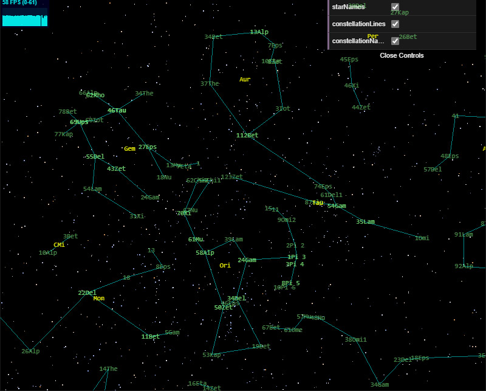
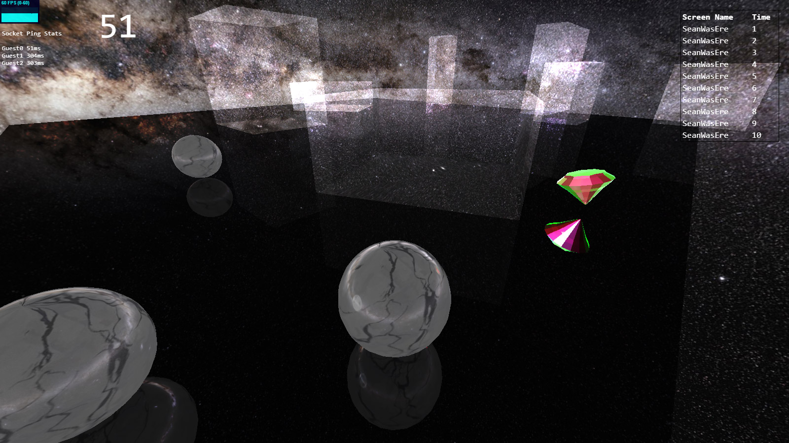
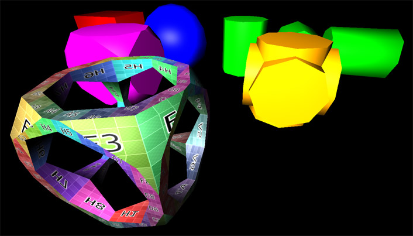
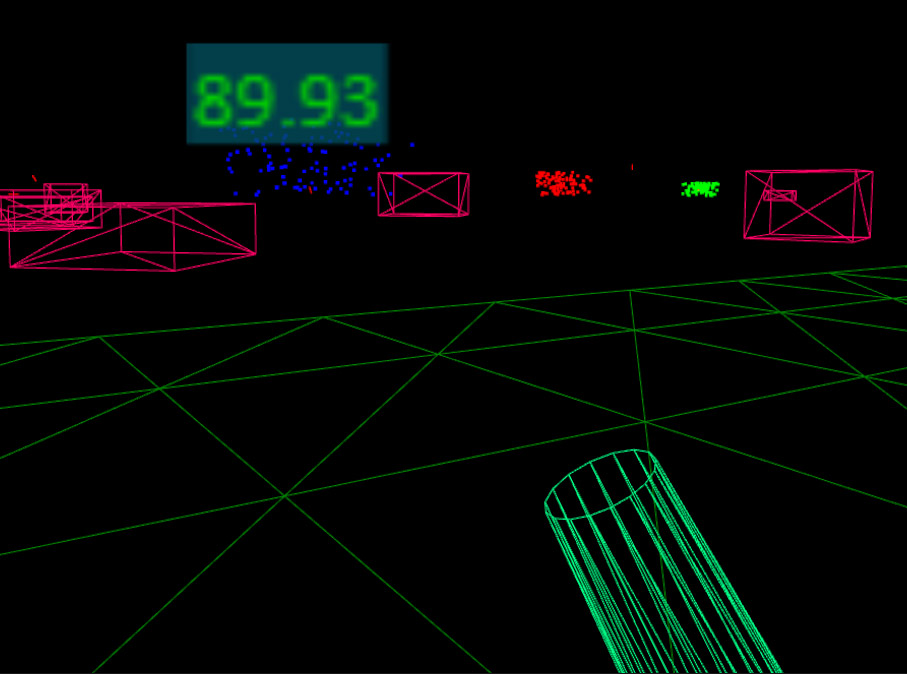
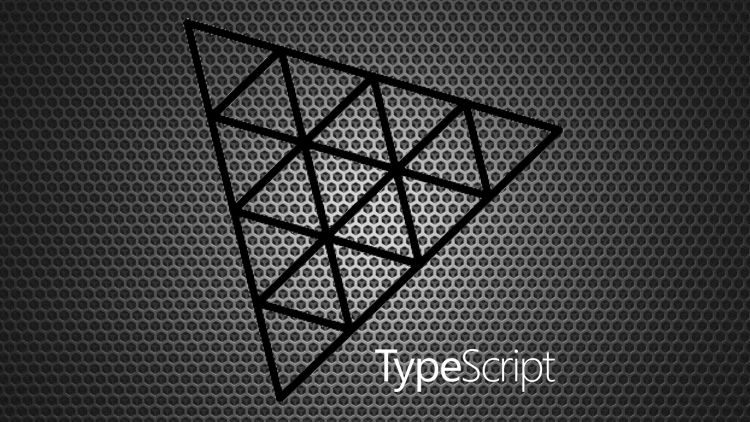

# Three.js TypeScript Boilerplate

This boilerplate is supplementary to my book titled **Three.js and TypeScript** (ASIN : B09GYTKRCH)



&nbsp;<a href="https://www.amazon.com/dp/B09GYTKRCH">&nbsp; https://www.amazon.com/dp/B09GYTKRCH</a><br/>
&nbsp;<a href="https://www.amazon.co.uk/dp/B09GYTKRCH">&nbsp; https://www.amazon.co.uk/dp/B09GYTKRCH</a><br/>
&nbsp;<a href="https://www.amazon.in/dp/B09GYTKRCH">&nbsp; https://www.amazon.in/dp/B09GYTKRCH</a><br/>
&nbsp;<a href="https://www.amazon.de/dp/B09GYTKRCH">&nbsp; https://www.amazon.de/dp/B09GYTKRCH</a><br/>
&nbsp;<a href="https://www.amazon.fr/dp/B09GYTKRCH">&nbsp; https://www.amazon.fr/dp/B09GYTKRCH</a><br/>
&nbsp;<a href="https://www.amazon.es/dp/B09GYTKRCH">&nbsp; https://www.amazon.es/dp/B09GYTKRCH</a><br/>
&nbsp;<a href="https://www.amazon.it/dp/B09GYTKRCH">&nbsp; https://www.amazon.it/dp/B09GYTKRCH</a><br/>
&nbsp;<a href="https://www.amazon.nl/dp/B09GYTKRCH">&nbsp; https://www.amazon.nl/dp/B09GYTKRCH</a><br/>
&nbsp;<a href="https://www.amazon.co.jp/dp/B09GYTKRCH">&nbsp; https://www.amazon.co.jp/dp/B09GYTKRCH</a><br/>
&nbsp;<a href="https://www.amazon.ca/dp/B09GYTKRCH">&nbsp; https://www.amazon.ca/dp/B09GYTKRCH</a><br/>
&nbsp;<a href="https://www.amazon.com.br/dp/B09GYTKRCH">&nbsp; https://www.amazon.com.br/dp/B09GYTKRCH</a><br/>
&nbsp;<a href="https://www.amazon.com.mx/dp/B09GYTKRCH">&nbsp; https://www.amazon.com.mx/dp/B09GYTKRCH</a><br/>
&nbsp;<a href="https://www.amazon.com.au/dp/B09GYTKRCH">&nbsp; https://www.amazon.com.au/dp/B09GYTKRCH</a>

and my **ThreeJS and TypeScript** courses at [Udemy](https://www.udemy.com/course/threejs-tutorials/?referralCode=4C7E1DE91C3E42F69D0F), [YouTube (Channel membership required)](https://www.youtube.com/playlist?list=PLKWUX7aMnlEKTmkBqwjc-tZgULJdNBjEd) and [Skillshare](https://skl.sh/2uxctEP)

It is only just the beginning of what you will create.

Course Discount Coupons : https://sbcode.net/coupons#threejs

## Boilerplate Overview

When run, the boilerplate shows a green wireframe rotating cube, with OrbitControls included.

[Example](https://sbcode.net/threejs/threejs-typescript-boilerplate/)

It uses webpack-dev-server for the development build, and NodeJS with Express for production build.

Both server and client projects are written in TypeScript.



## Installing

1. Clone Repository

```bash
git clone https://github.com/Sean-Bradley/Three.js-TypeScript-Boilerplate.git
```

2. CD into folder

```bash
cd Three.js-TypeScript-Boilerplate
```

3. Install TypeScript

```bash
npm install -g typescript
```

4. Install dependencies

```bash
npm install
```

5. Start it

```bash
npm run dev
```

6. Visit [http://127.0.0.1:8080](http://127.0.0.1:8080)

You should see a rotating green wireframe cube, and be able to rotate it further with your mouse.

7. Edit project in VSCode

```bash
code .
```

## Branches

The default **master** branch does not include **Stats.js**, **Dat.GUI** or **Socket.IO**

### stats.js

To get a version of the boilerplate that includes the **Stats.js** panel then,

```bash
git checkout stats
npm install
npm run dev
```

Visit [http://127.0.0.1:8080](http://127.0.0.1:8080)


View example on [CodeSandbox.io](https://codesandbox.io/s/github/Sean-Bradley/Three.js-TypeScript-Boilerplate/tree/stats/)

### DAT.gui

To get a version of the boilerplate that includes the **Stats** and the **Dat.GUI** panels then,

```bash
git checkout statsgui
npm install
npm run dev
```

Visit [http://127.0.0.1:8080](http://127.0.0.1:8080)



View example on [CodeSandbox.io](https://codesandbox.io/s/github/Sean-Bradley/Three.js-TypeScript-Boilerplate/tree/statsgui/)

### Socket.IO

To get a version of the boilerplate that includes **Socket.IO** then,

```bash
git checkout socketio
npm install
npm run dev
```

Visit [http://127.0.0.1:8080](http://127.0.0.1:8080)


Open 2 or more browsers, and you can move the cube around and rotate it. You will see the cube mirror itself in the other browsers. Each browser controls there own cube.

View example on [CodeSandbox.io](https://codesandbox.io/s/github/Sean-Bradley/Three.js-TypeScript-Boilerplate/tree/socketio/)

### Cannon.js

To get a version of the boilerplate that includes **Cannon.js** then

```bash
git checkout cannonjs
npm install
npm run dev
```

Visit [http://127.0.0.1:8080](http://127.0.0.1:8080)


View example on [CodeSandbox.io](https://codesandbox.io/s/github/Sean-Bradley/Three.js-TypeScript-Boilerplate/tree/cannonjs/)

### Webcam as Texture

To get a version of the boilerplate that uses your webcam as a texture then

```bash
git checkout webcam
npm install
npm run dev
```

Visit [http://127.0.0.1:8080](http://127.0.0.1:8080)



View example on [CodeSandbox.io](https://codesandbox.io/s/github/Sean-Bradley/Three.js-TypeScript-Boilerplate/tree/webcam/)

### BSC5 Bright Star Catalog

To get a version of the boilerplate that shows the BSC5 Bright Star Catalog Data with Constellations

```bash
git checkout bsc5
npm install
npm run dev
```

Visit [http://127.0.0.1:8080](http://127.0.0.1:8080)



View example on [CodeSandbox.io](https://codesandbox.io/s/github/Sean-Bradley/Three.js-TypeScript-Boilerplate/tree/bsc5/)

### The Ball Game

The Ball Game is an example of a multiplayer game using Threejs, SocketIO and server side Cannonjs.

To get The Ball Game branch

```bash
git checkout ballgame
npm install
npm run dev
```

Visit [http://127.0.0.1:8080](http://127.0.0.1:8080)



### Annotations

To get a version of the boilerplate that demonstrates annotations

```bash
git checkout annotations
npm install
npm run dev
```

Visit [http://127.0.0.1:8080](http://127.0.0.1:8080)


View example on [CodeSandbox.io](https://codesandbox.io/s/github/Sean-Bradley/Three.js-TypeScript-Boilerplate/tree/annotations/)

### Constructive Solid Geometry

To get a version of the boilerplate that demonstrates Constructive Solid Geometry (CSG)

```bash
git checkout csg
npm install
npm run dev
```

Visit [http://127.0.0.1:8080](http://127.0.0.1:8080)



View example on [CodeSandbox.io](https://codesandbox.io/s/github/Sean-Bradley/Three.js-TypeScript-Boilerplate/tree/csg/)

### WebXR

To get a version of the boilerplate that demonstrates WebXR

```bash
git checkout webxr
npm install
npm run dev
```

Visit [http://127.0.0.1:8080](http://127.0.0.1:8080)



View example on [CodeSandbox.io](https://codesandbox.io/s/github/Sean-Bradley/Three.js-TypeScript-Boilerplate/tree/webxr/)

---

## ThreeJS and TypeScript Course Introduction Video

This boilerplate was created as a sub project of my [ThreeJS and TypeScript Course](https://www.udemy.com/course/threejs-tutorials/?referralCode=4C7E1DE91C3E42F69D0F) and is only just the beginning of what you will create.

[](https://youtu.be/fS4H7gm7gK4)

## Design Patterns In TypeScript

To help support my TypeScript projects, please check out my book titled **Design Patterns in TypeScript**.


&nbsp;<a href="https://www.amazon.com/dp/B0948BCH24">&nbsp; https://www.amazon.com/dp/B0948BCH24</a><br/>
&nbsp;<a href="https://www.amazon.co.uk/dp/B0948BCH24">&nbsp; https://www.amazon.co.uk/dp/B0948BCH24</a><br/>
&nbsp;<a href="https://www.amazon.in/dp/B094716FD6">&nbsp; https://www.amazon.in/dp/B094716FD6</a><br/>
&nbsp;<a href="https://www.amazon.de/dp/B0948BCH24">&nbsp; https://www.amazon.de/dp/B0948BCH24</a><br/>
&nbsp;<a href="https://www.amazon.fr/dp/B0948BCH24">&nbsp; https://www.amazon.fr/dp/B0948BCH24</a><br/>
&nbsp;<a href="https://www.amazon.es/dp/B0948BCH24">&nbsp; https://www.amazon.es/dp/B0948BCH24</a><br/>
&nbsp;<a href="https://www.amazon.it/dp/B0948BCH24">&nbsp; https://www.amazon.it/dp/B0948BCH24</a><br/>
&nbsp;<a href="https://www.amazon.co.jp/dp/B0948BCH24">&nbsp; https://www.amazon.co.jp/dp/B0948BCH24</a><br/>
&nbsp;<a href="https://www.amazon.ca/dp/B0948BCH24">&nbsp; https://www.amazon.ca/dp/B0948BCH24</a><br/>
&nbsp;<a href="https://www.amazon.com.au/dp/B094716FD6">&nbsp; https://www.amazon.com.au/dp/B094716FD6</a>

(ASIN : B0948BCH24 / B094716FD6)
