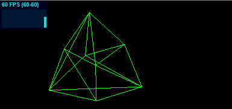
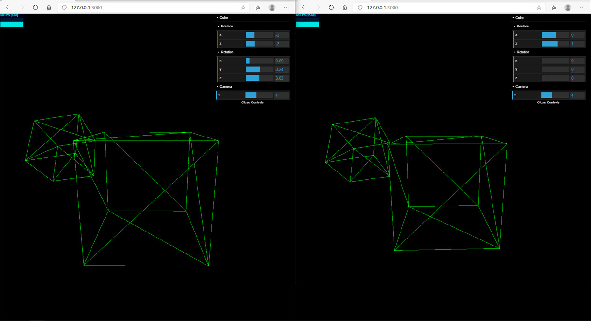
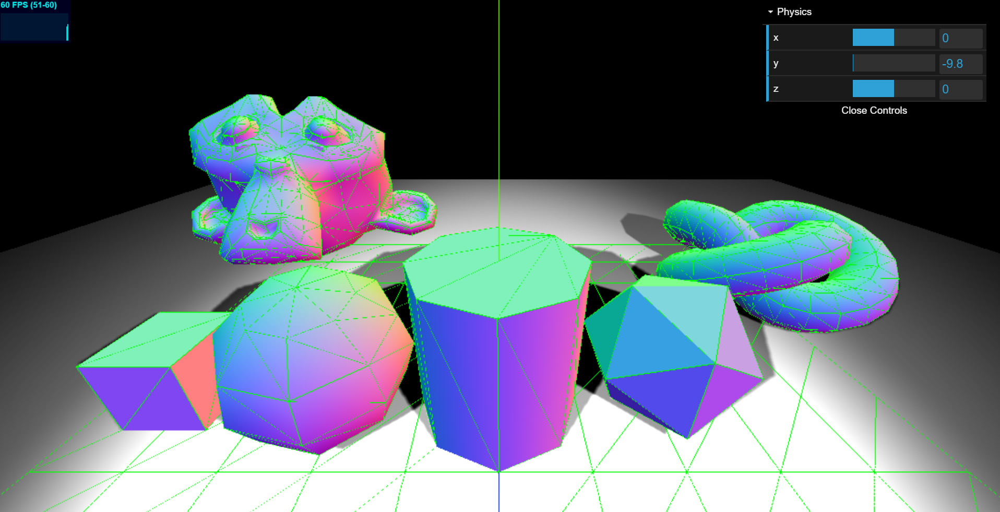
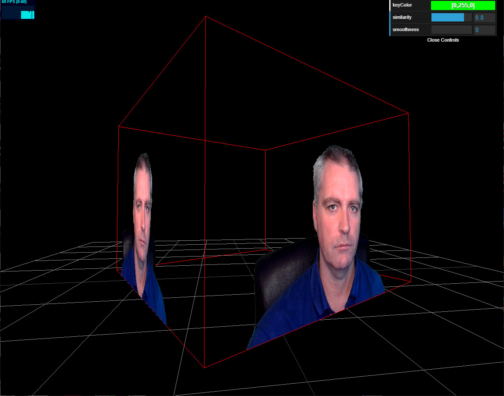

# Three.js TypeScript Boilerplate

> This boilerplate was created as a sub project of my [ThreeJS and TypeScript Course](https://www.udemy.com/course/threejs-tutorials/?referralCode=4C7E1DE91C3E42F69D0F) and is only just the beginning of what you will create.
  Discount Coupon : https://sbcode.net/coupons#threejs

When run, the boilerplate shows a green wireframe rotating cube, with OrbitControls included. 

[Example](https://sbcode.net/threejs/threejs-typescript-boilerplate/)

It is hosted using NodeJS and Express.

It contains server and client scripts both written in TypeScript.

The client typescript and compiled javascript both use [ES6 import syntax](https://developer.mozilla.org/en-US/docs/Web/JavaScript/Reference/Statements/import)


## Installing

1. Clone Repository

```bash
git clone https://github.com/Sean-Bradley/Three.js-TypeScript-Boilerplate.git
```

2. CD into folder
```bash
cd Three.js-TypeScript-Boilerplate
```

3. Install TypeScript

```bash
npm install -g typescript
```

4. Install dependencies

```bash
npm install
```

5. Start it

```bash
npm run dev
```

6. Visit [http://127.0.0.1:3000/](http://127.0.0.1:3000/)

You should see a rotating green wireframe cube, and be able to rotate it further with your mouse.

7. Edit project in VSCode
```bash
code .
```

## Branches

The default **master** branch does not include **Stats.js**, **Dat.GUI** or **Socket.IO**

### stats.js

To get a version of the boilerplate that includes the **Stats.js** panel then,
```bash
git checkout stats
```


View example on [CodeSandbox.io](https://codesandbox.io/s/github/Sean-Bradley/Three.js-TypeScript-Boilerplate/tree/stats/)

### DAT.gui
To get a version of the boilerplate that includes the **Stats** and the **Dat.GUI** panels then,
```bash
git checkout statsgui
npm install
npm run dev
```


View example on [CodeSandbox.io](https://codesandbox.io/s/github/Sean-Bradley/Three.js-TypeScript-Boilerplate/tree/statsgui/)

### Socket.IO

To get a version of the boilerplate that includes **Socket.IO** then,
```bash
git checkout socketio
npm install
npm run dev
```



Open 2 or more browsers, and you can move the cube around and rotate it. You will see the cube mirror itself in the other browsers. Each browser controls there own cube.

View example on [CodeSandbox.io](https://codesandbox.io/s/github/Sean-Bradley/Three.js-TypeScript-Boilerplate/tree/socketio/)

### Cannon.js
To get a version of the boilerplate that includes **Cannon.js** then

```bash
git checkout cannonjs
npm install
npm run dev
```



View example on [CodeSandbox.io](https://codesandbox.io/s/github/Sean-Bradley/Three.js-TypeScript-Boilerplate/tree/cannonjs/)

### Webcam as Texture
To get a version of the boilerplate that uses your webcam as a texture then

```bash
git checkout webcam
npm install
npm run dev
```



View example on [CodeSandbox.io](https://codesandbox.io/s/github/Sean-Bradley/Three.js-TypeScript-Boilerplate/tree/webcam/)

### BSC5 Bright Star Catalog

To get a version of the boilerplate that shows the BSC5 Bright Star Catalog Data with Constellations

```bash
git checkout bsc5
npm install
npm run dev
```


View example on [CodeSandbox.io](https://codesandbox.io/s/github/Sean-Bradley/Three.js-TypeScript-Boilerplate/tree/bsc5/)

### The Ball Game

The Ball Game is an example of a multiplayer game using Threejs, SocketIO and server side Cannonjs. 

To get The Ball Game branch

```bash
git checkout ballgame
npm install
npm run dev
```


---

## ThreeJS and TypeScript Course Introduction Video

This boilerplate was created as a sub project of my [ThreeJS and TypeScript Course](https://www.udemy.com/course/threejs-tutorials/?referralCode=4C7E1DE91C3E42F69D0F) and is only just the beginning of what you will create.

[](https://youtu.be/BcF3yuVqfwo)

